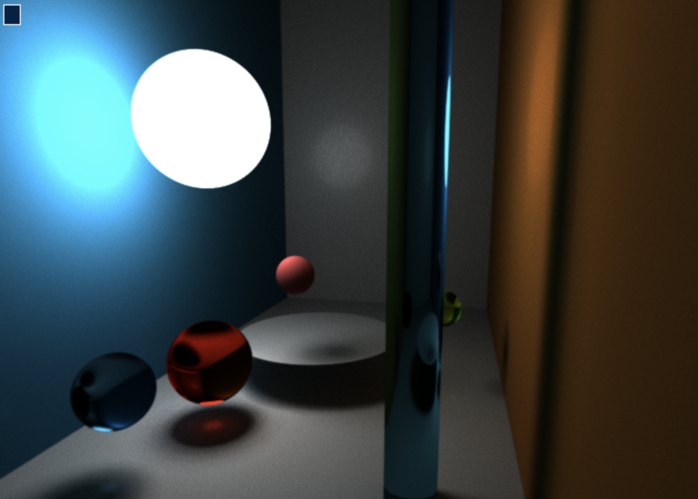

<h1 align="center">
  <br>
    Raytracer (README UNDER CONSTRUCTION)
  <br>
</h1>

<div align="center">
  </img>
</div>

<h3 align="center">RAY TRACER ENGINE WRITTEN IN SDL2</h3>

<p align="center">
  <a href="#what-does-it-do">What does it do?</a> •
  <a href="#how-to-use">How To Use</a>
</p>


## What does it do?

* Renders pretty images.
* Uses ray tracing.

</img>


## How To Use

** NOTES HERE **

```bash
# Clone this repository
$ git clone ** LINK **
# Build the program by typing:
$ make
# in command line
# Happy wireframing.
```
